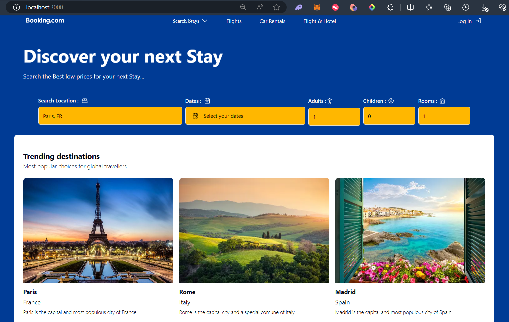

# BDWooking project

### **SKILLS**

<span style="margin-left: 15px;">

[](https://skillicons.dev)
</span>

<div style="margin-top: 40px;"></div>

---

### **PROVISIONAL RENDER**



## Getting Started

First, run the development server:

```bash
npm run dev
# or
yarn dev
# or
pnpm dev
# or
bun dev
```

Open [http://localhost:3000](http://localhost:3000) with your browser to see the result.

You can start editing the page by modifying `app/page.tsx`. The page auto-updates as you edit the file.

<!-- This project uses [`next/font`](https://nextjs.org/docs/basic-features/font-optimization) to automatically optimize and load Inter, a custom Google Font. -->
